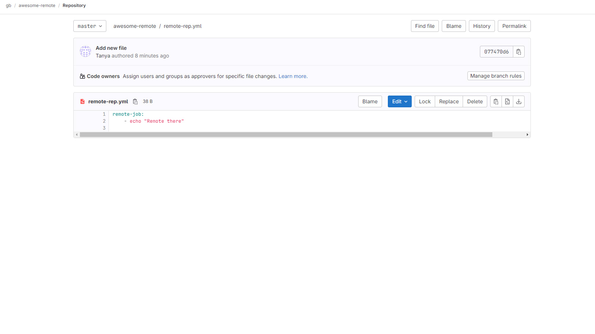
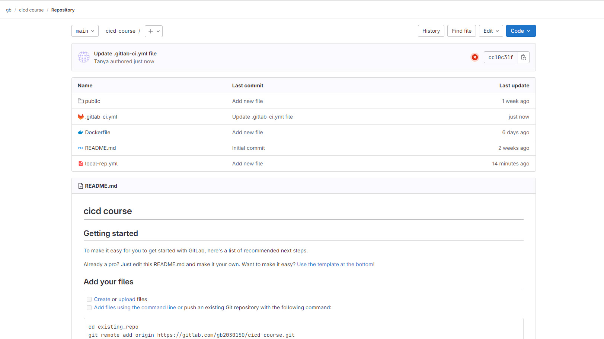
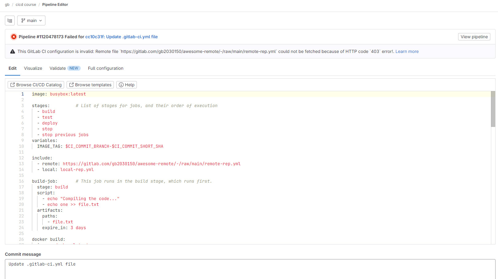

# Домашняя работа №4

Создала удаленный репозиторий и файл ямл в нем:

Создала новый файл ямл в локальном репозитории:

Основной пайплайн проекта:

По каким-то неведомым мне причинам репозитории публичными делаться не хотят, эта функция просто не выбирается и всё, делайте локальные. Так что не могу показать успешное выполнение.