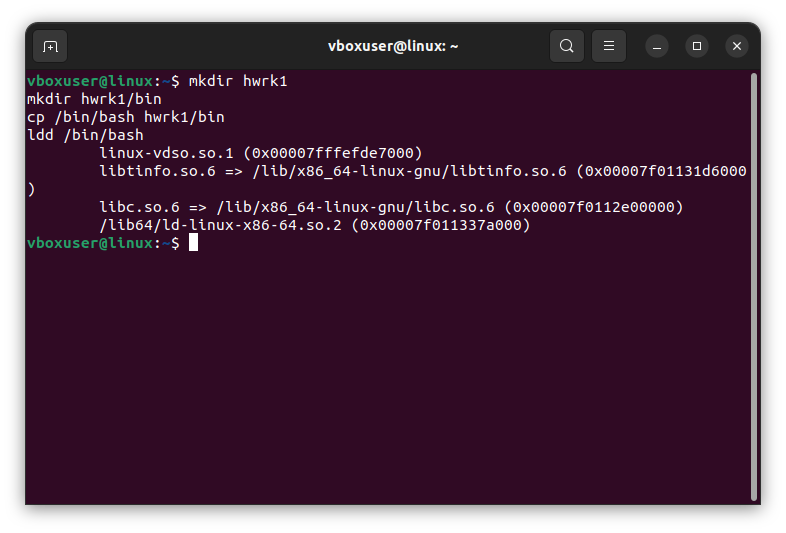
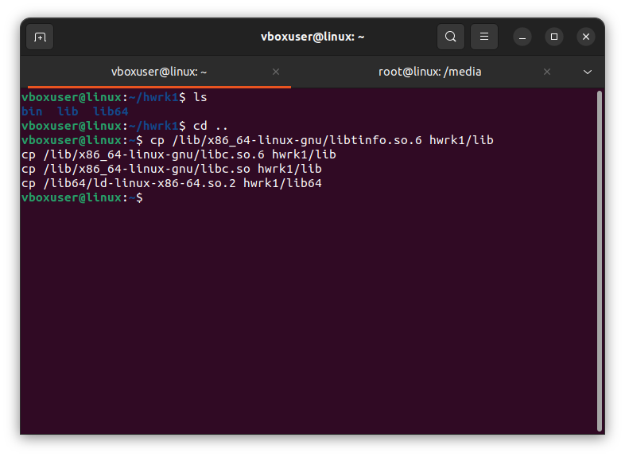
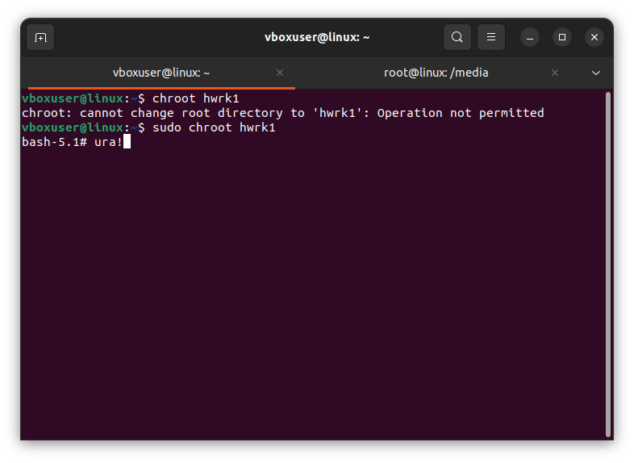
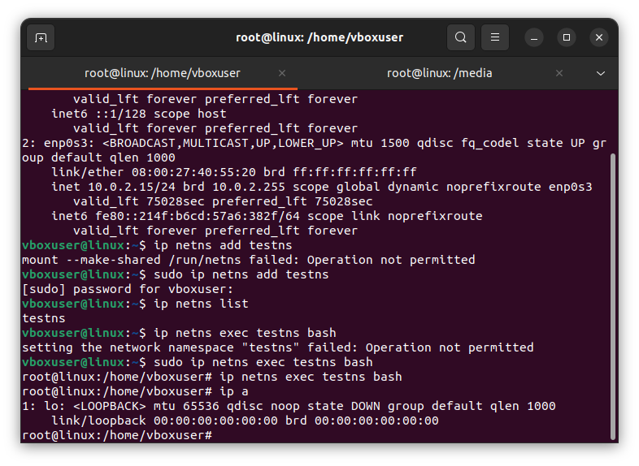
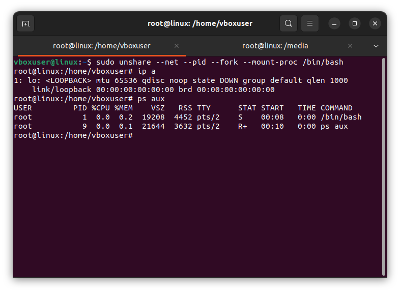

# Контейнеризация, урок 1. 
## Механизмы пространства имён

**Задание: необходимо продемонстрировать изоляцию одного и того же приложения (как решено на семинаре - командного интерпретатора) в различных пространствах имен.**

1. Не будем каждый раз поражаться тому, что ах почему же не работает, давайте просто команды и сё :)

        mkdir hwrk1

        mkdir hwrk1/bin

        cp /bin/bash hwrk1/bin

        ldd /bin/bash

    mkdir hwrk1/lib

    mkdir hwrk1/lib64

    cp /lib/x86_64-linux-gnu/libtinfo.so.6 hwrk1/lib
    cp /lib/x86_64-linux-gnu/libc.so.6 hwrk1/lib
    cp /lib/x86_64-linux-gnu/libc.so hwrk1/lib
    cp /lib64/ld-linux-x86-64.so.2 hwrk1/lib64

    chroot hwrk1

2. 

    ip netns add testns

    ip netns list

    ip netns exec testns bash

3.

    unshare --net --pid --fork --mount-proc /bin/bash
    ip a
    ps aux
