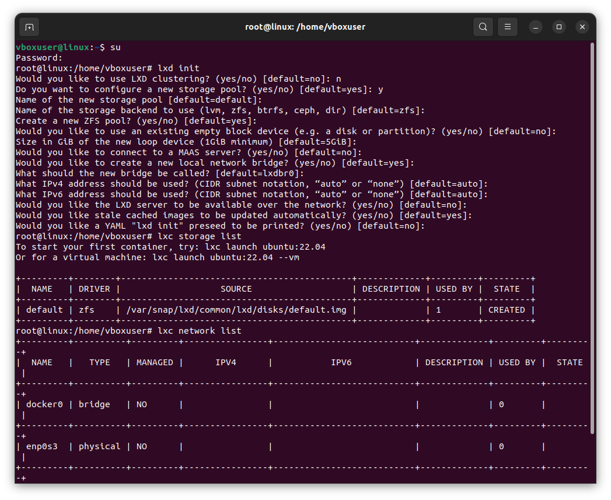
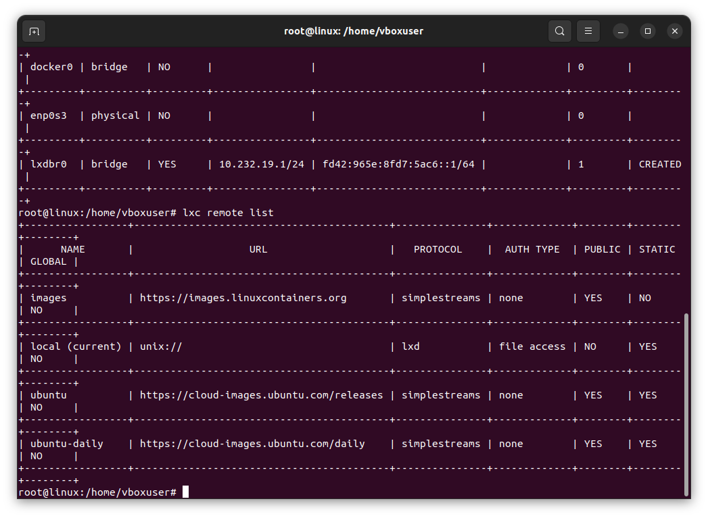
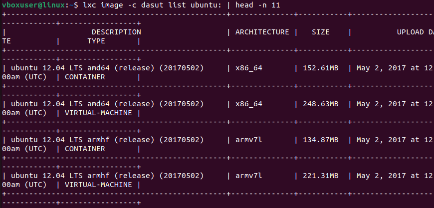
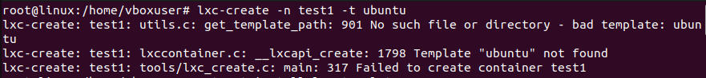
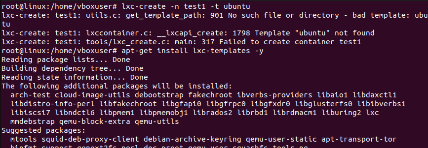
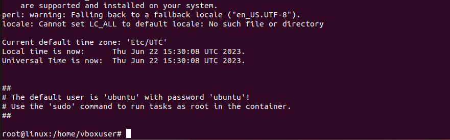
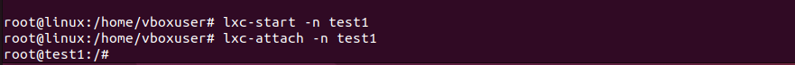
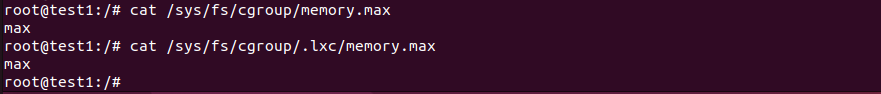
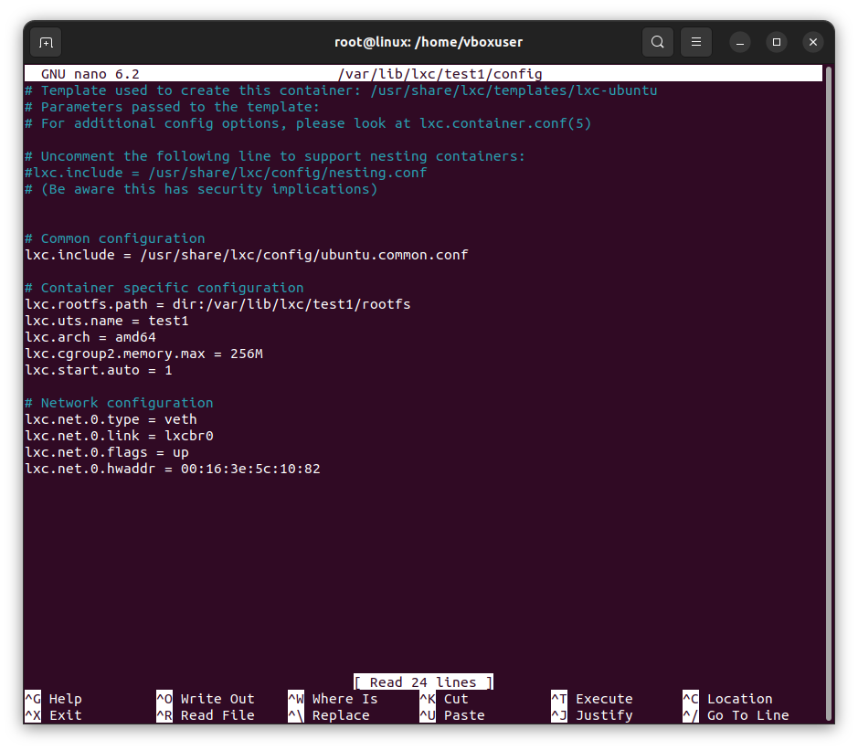
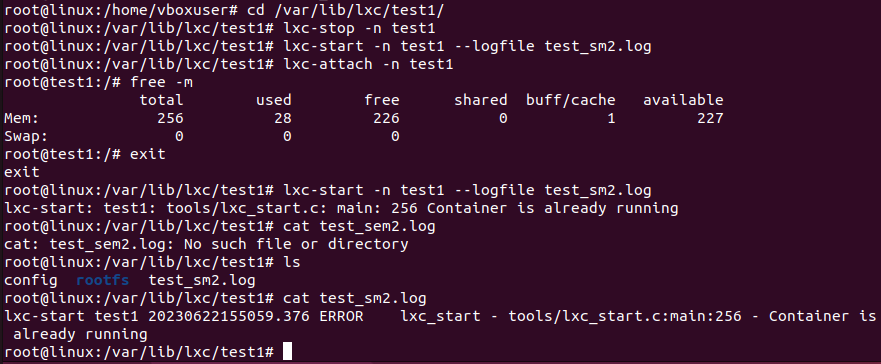

# Контейнеризация, урок 2.
## Механизмы контрольных групп 

### Задание:

1) запустить контейнер с ubuntu, используя механизм LXC
2) ограничить контейнер 256 Мб ОЗУ и проверить, что ограничение работает

Задание по желанию

4) добавить автозапуск контейнеру, перезагрузить ОС и убедиться, что контейнер действительно запустился самостоятельно
5) при создании указать файл, куда записывать логи
6) после перезагрузки проанализировать логи

### Решение:

Инициализация:

    lxd init
    lxc storage list
    lxc network list
    lxc remote list

Там еще ip a было, но скрин потерян. Помашем ему лапкой.

    lxc image -c dasut list ubuntu: | head -n 11
    cat /etc/default/lxc-net
    cat /etc/lxc/default.conf

 

Создаём контейнер:

а нет, не создаём.
Нужно сначала загрузить шаблоны. 

    sudo apt-get install lxc-templates
    sudo apt-get update && sudo apt-get upgrade

От теперь создаём.

    lxc-create -n test1 -t ubuntu

И понеслось! Тут я успела пообедать, попить чай, поспать, прожить жизнь и вот, наконец увидела это:

Запускаю контейнер и захожу туда

    lxc-start -n test1
    lxc-attach -n test1

Проверка памяти:

    cat /sys/fs/cgroup/memory.max
    cat /sys/fs/cgroup/.lxc/memory.max

Выделен максимум. Ограничиваю память, заодно автозапуск устанавливаю. Это делается в файле /var/lib/lxc/test1/config, открываю, вставляю в раздел Container specific configuration строчки `lxc.cgroup2.memory.max = 256M` и `lxc.start.auto = 1`

Дальше перезапуск c созданием лог-файла: 

    lxc-stop -n test1
    lxc-start -n test1 --logfile test_sem2.log
    lxc-attach -n test1    

Посмотрели на память, вышли, запустили еще раз, получили ошибку, смотрим лог
Без лишних букв, конечно, никак. 
В логе ошибка запуска, значит ошиблись с запуском. Это был самый сложный анализ в этом году.

Спасибо за внимание. 
