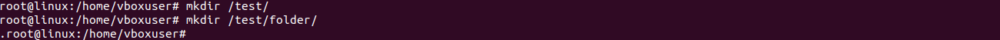
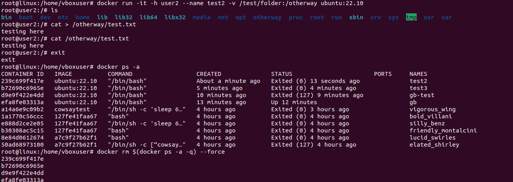
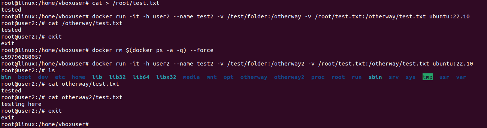
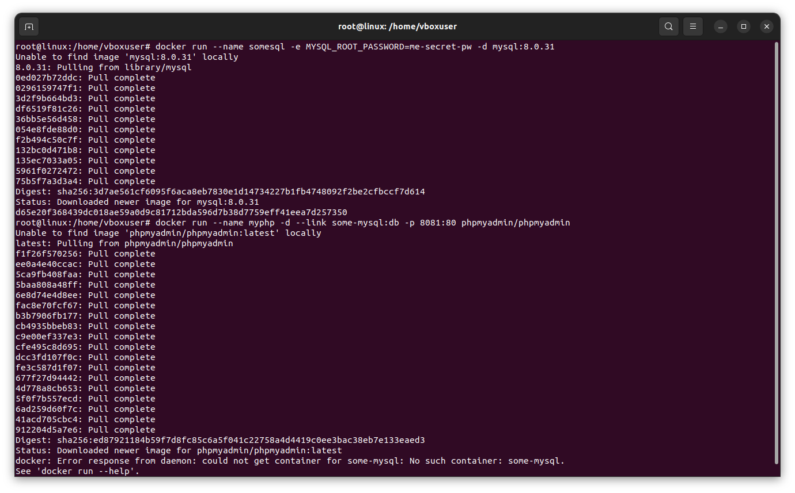
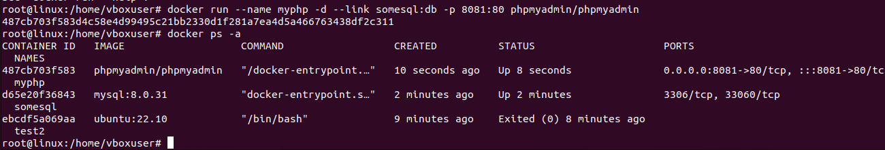
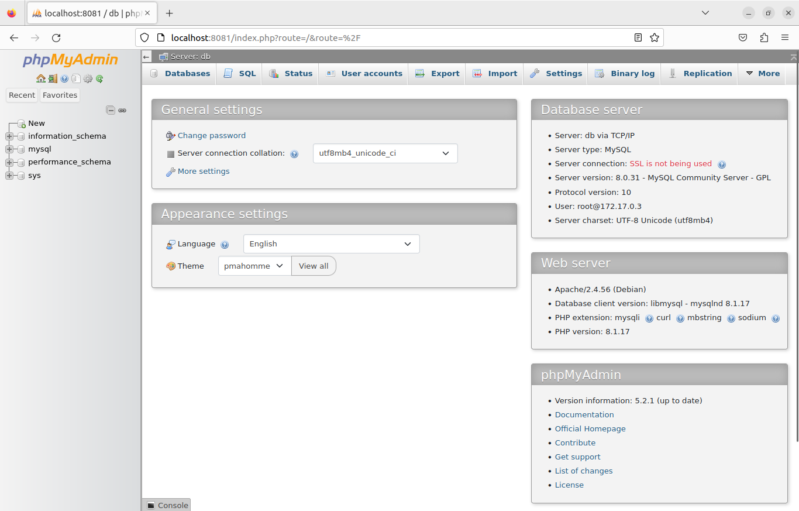
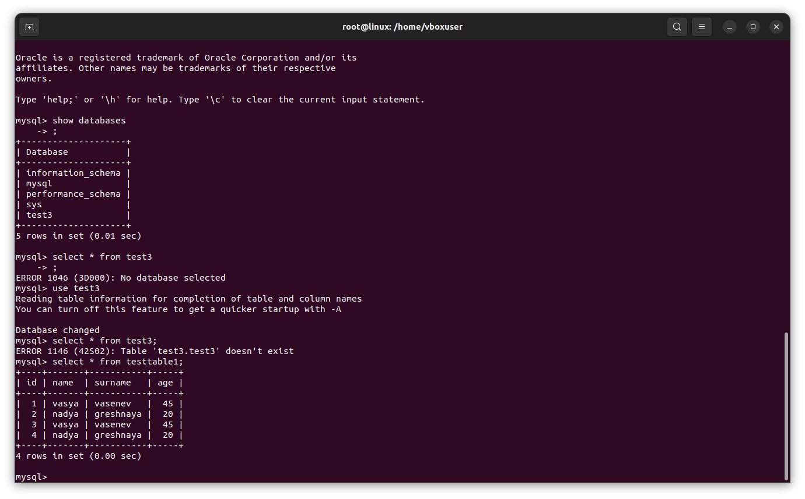

# Контейнеризация, урок 3.
## Введение в Docker

### Задание:

*Создать папку, которую мы будем готовы смонтировать в контейнер
В этой папке создать файл test.txt и наполнить данными
В домашней директории создать файл test.txt, который также необходимо будет смонтировать в контейнер и наполнить совершенно другими данными
Создать контейнер из образа ubuntu:22.10
Задать ему имя
Задать hostname
Смонтировать созданную ранее папку с хоста в контейнер
Смонтировать созданный ранее текстовый файл внутрь смонтированной папки, чтобы он пересекался с созданным ранее файлом в этой папке. Просмотреть этот файл.*

### Решение:

### Задание 2:

*запустить контейнер с БД, отличной от mariaDB, используя инструкции на сайте: https://hub.docker.com/
добавить в контейнер hostname такой же, как hostname системы через переменную
заполнить БД данными через консоль
запустить phpmyadmin (в контейнере) и через веб проверить, что все введенные данные доступны*

### Решение:
Команда для запуска mysql

    docker run --name somesql -e MYSQL_ROOT_PASSWORD=me-secret-pw -d mysql:8.0.31

Команда для запуска phpmyadmin

    docker run --name myphp -d --link some-mysql:db -p 8081:80 phpmyadmin/phpmyadmin

Проверяю, что всё на месте

Теперь можно пойти проверить, что пхпадмин работает:

Там создаю базу и таблицу, заполняю данными. Теперь можно это всё найти через консоль, запускаю контейнер:

    docker exec -it somesql bash

После входа в мускул:

