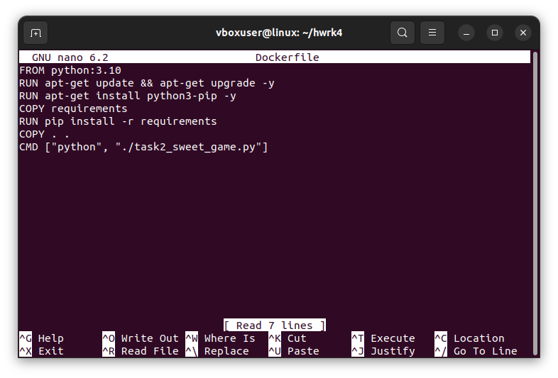
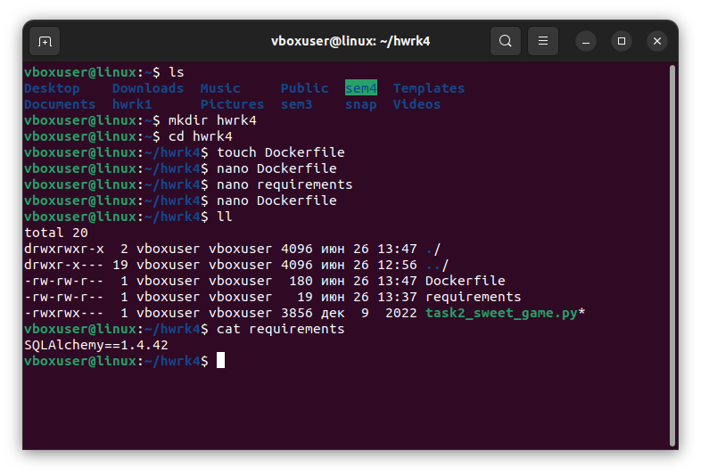
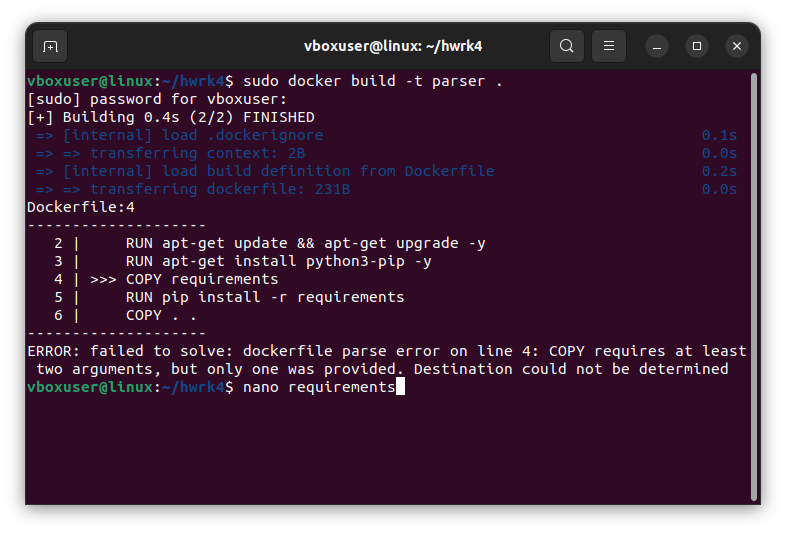
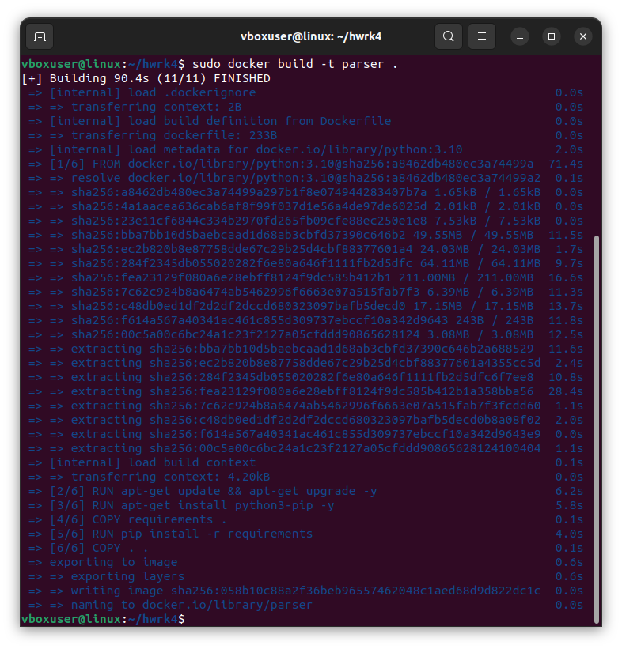
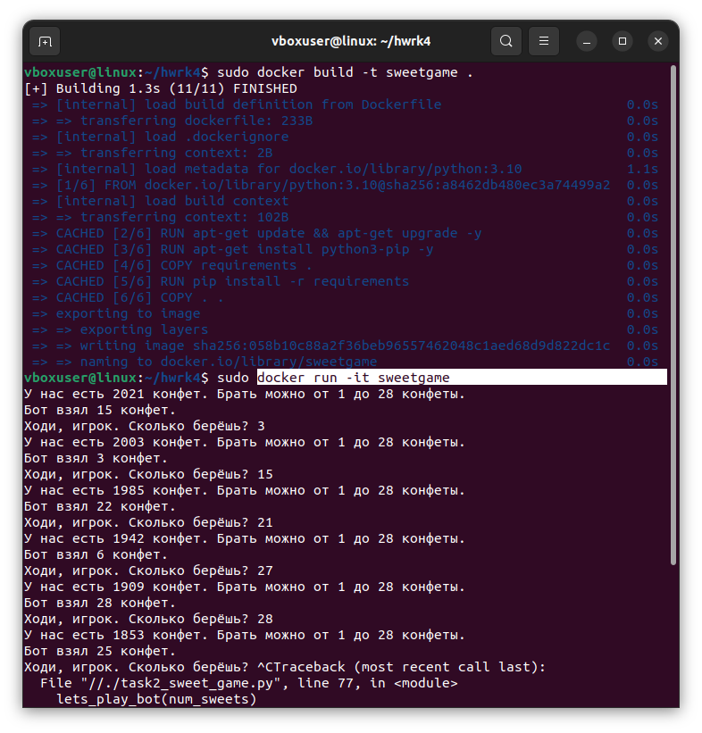
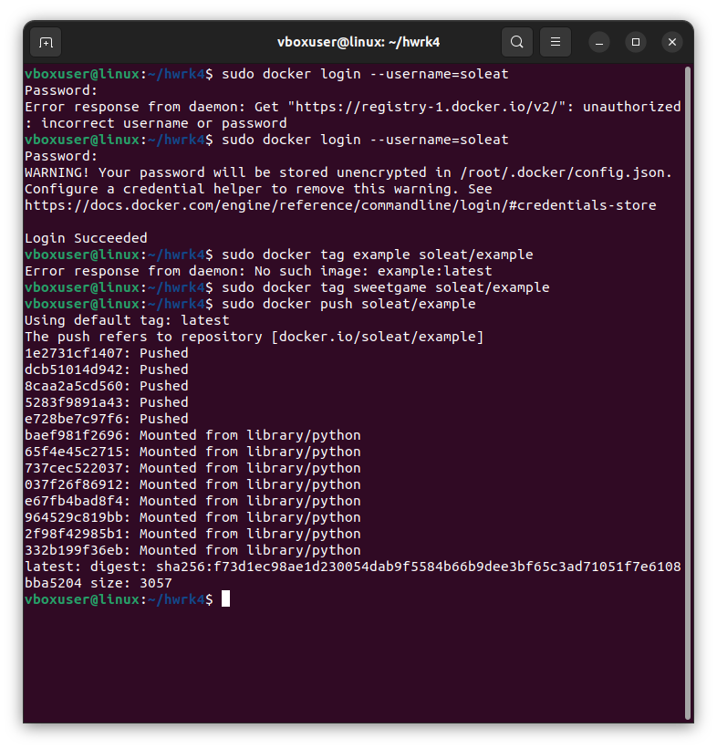
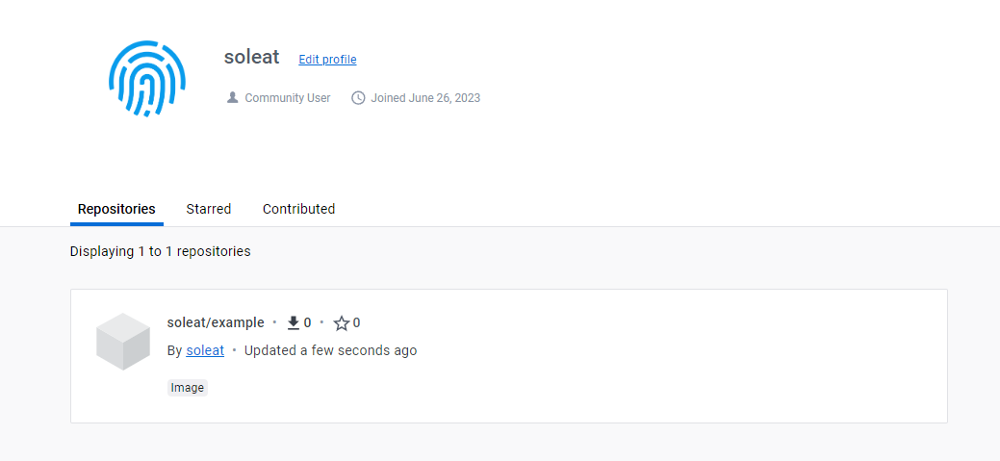

# Контейнеризация, урок 4.
## Dockerfile и слои
## *Задание:*

*Задание: необходимо создать Dockerfile, основанный на любом образе (вы в праве выбрать самостоятельно).
В него необходимо поместить приложение, написанное на любом известном вам языке программирования (Python, Java, C, С#, C++).
При запуске контейнера должно запускаться самостоятельно написанное приложение.*

## *Решение:*

## Пишем Dockerfile и не выпендриваемся с другим названием.

Содержимое докерфайла такое:

**Чего тут написано?**

Нет смысла создавать образ на основе убунты и внутри ставить питон, т.к. мы всё равно используем ядро уже установленной системы. Так что сразу на основе питона и создаём образ, фигли.

Для создания контейнера используется файл requirements с зависимостями. Там всего одна строчка, потому что, в принципе, нам не нужно там какое-то особое окружение создавать, это чисто для примера. Для того же и pip. И можно было прямо через докерфайл поставить эту библиотеку, но мы ж всё по правилам делаем, да? Да??

Так вот, файл requirements копируем внутрь образа, чтоб прямо там и установить нужные зависимости уже установленным pip.

Затем копируем внутрь всё содержимое текущей папки и пишем инструкцию сразу же запустить программу при запуске контейнера.

Что у нас имеется на данный момент:

## Создание образа

Для этого пишем в терминале команду

    docker build -t sweetgame

Ну конечно, что могло пойти так?

Дописываем грёбаную точку и запускаем ещё раз. Получаем вот что:

А, имя не то. Ещё раз:

Как видно, тут уже образ построился гораздо быстрее.
## Запускаем.

Сначала я написала просто команду run, образ запускался и сразу закрывался. А нам-то там нужно поиграться в конфетульки, поэтому правильной командой будет запуск в интерактивном режиме:

    docker run -it sweetgame

Всё супер, можно бы тут и закончить, но

## Чтоб дважды не вставать

Чего б до конца не довести и не поделиться своим мега нужным контейнером со всем миром? Ну ему ж явно не хватает моей домашки с основ питона.

Итак, идём регистрируемся на [DockerHub](https://hub.docker.com/). 
Коннектимся туда из системы. 
Помечаем контейнер и пушим его на сайт. Спасибо хабру за эту инструкцию.

Вот что получилось:

[Не возбраняется сходить посмотреть](https://hub.docker.com/r/soleat/example)

Если кто-то досюда дочитал, вот вам пирожок 🥧