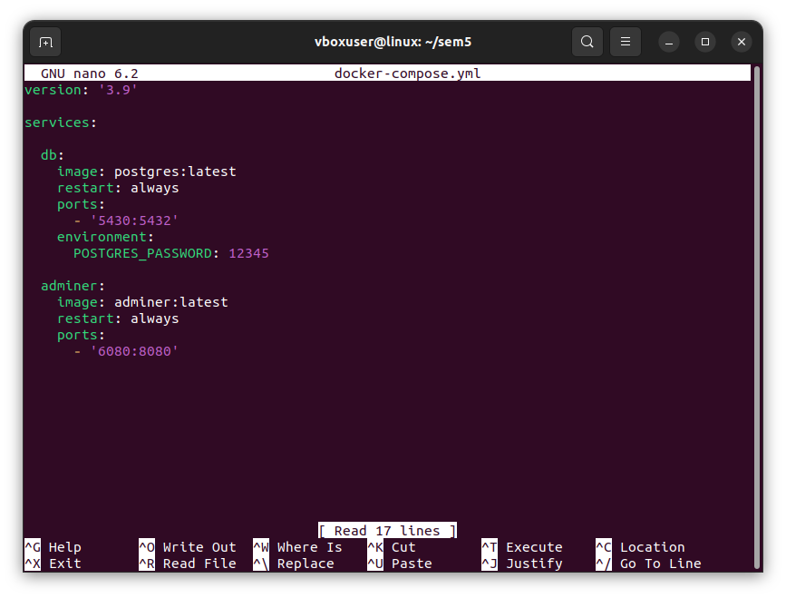
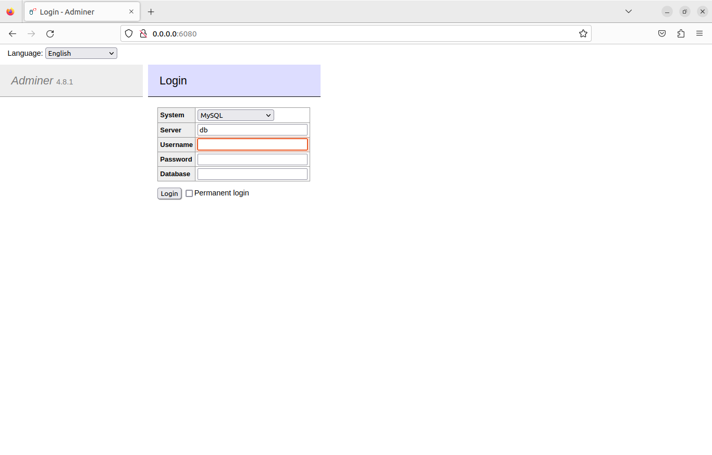
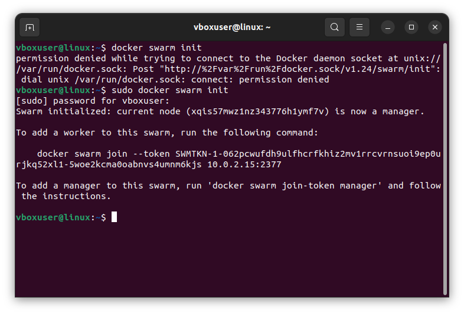
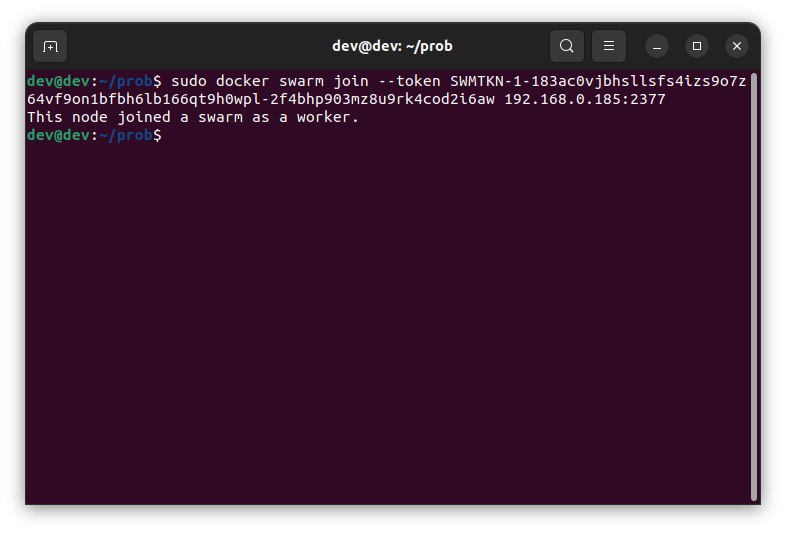
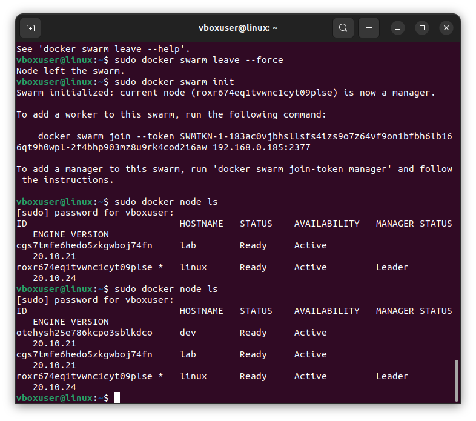
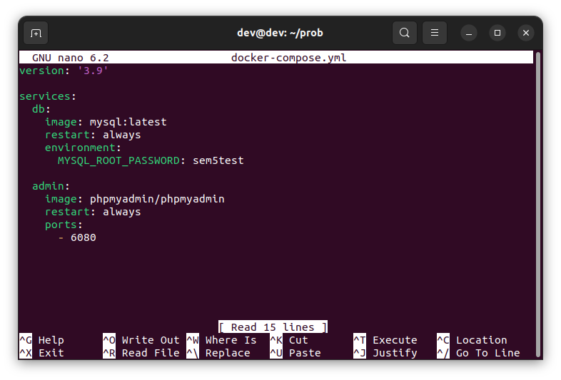
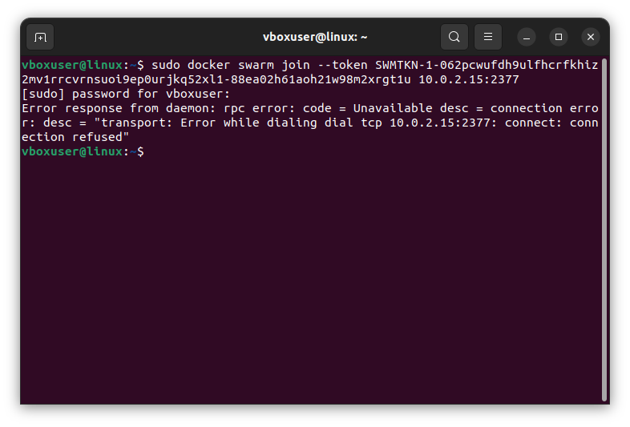

# Контейнеризация, урок 5.
## Docker Compose и Docker Swarm.
## *Задание:*
Задание 1:
1) создать сервис, состоящий из 2 различных контейнеров: 1 - веб, 2 - БД
Задание со звездочкой - повышенной сложности..
** не обязательно 2) необходимо создать 3 сервиса в каждом окружении (dev, prod, lab)
** не обязательно 3) по итогу на каждой ноде должно быть по 2 работающих контейнера
4) выводы зафиксировать

## *Решение:*

Пишу yaml-файл с инструкциями и запускаю командой

    docker-compose up -d

Файл выглядит так:    

Проверяю в браузере, всё запустилось:

Задание 2.
Создаю ещё 2 виртуальных машины.
На первой машине запускаю менеджер командой

    docker swarm init
 

На остальных машинах использую выданную строчку с токеном и подсоединяю их к кластеру.

 

Проверка:

    docker node ls

 

 

Как видно, все три машины теперь в кластере.

Для запуска сервисов пишу yaml-файлы такого типа и запускаю на каждой ноде.

 

Понятней не стало, если что.

## Нытьё.

У меня по второму заданию масса вопросов к человеку, который его придумал. 
Почему от нас требуется сделать то, что толком не объяснили на лекции и вообще проигнорировали на семинаре (я видела первоначальное задание и там было написано - сделать обязательно)? Почему вообще рассказ про swarm в лекции начинается с "вот у меня 3 окружения"? А где ты их взял? Тут я слышала, что "у нас для начинающих курс", ну вот я начинающая и нихрена не понимаю, что тут вообще происходит. А то для чего-то у нас курс для начинающих, а для чего-то - ну тут же любому админу с опытом в трульон лет всё ясно, откуда вообще у вас вопросы?

С этим заданием всё было плохо. Я пыталась сделать через docker-machine, но мы не можем запустить docker-machine, потому что виртуализация выключена (нет. она включена. как решить? гугл не знает, но вы, как админы с опытом в трульон лет, должны сами понять). Мы не можем клонировать виртуальную машину и по-человечески из неё запуститься, потому что ошибка:

 

Мне пришлось создавать новые виртуальные машины, которые не минуту ставятся, настраивать и каждой вручную прописывать айпишники, чтобы они не вредничали. И через 5 минут работы их уничтожить. Ой какая потеря времени не зря.
Это вообще в целом несколько дней заняло, а можно ведь было на что-нибудь более интересное потратить их, а зачем? Где мне это пригодится? Думаю, ответ всем известен.

Вывод один: от карьеры админа я хочу держаться как можно дальше.